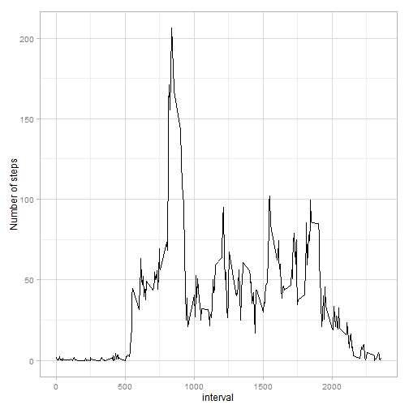
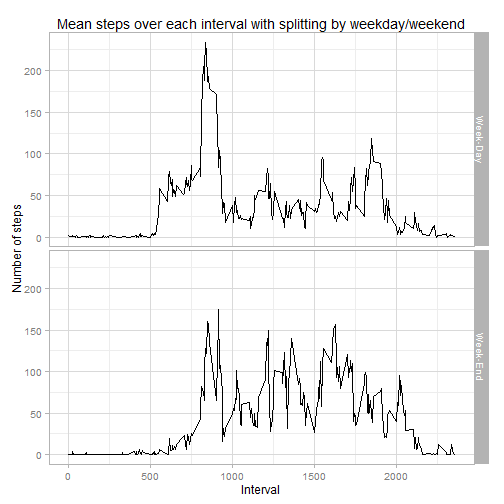

Reproducible Research: Peer Assessment 1
========================================

By **romkhot**

Loading and preprocessing the data
----------------------------------

Loading necessary packages and set working directory:

    library(plyr)
    library(ggplot2)
    setwd(dir = "D:\\DOCs\\COURSERA\\5 - Reproducible Research\\CP1\\RepData_PeerAssess1")

Unzip and read source data:

    unzip('activity.zip')
    activity_data <- read.csv('activity.csv', header=TRUE, sep = ',')
    str(activity_data)

    ## 'data.frame':    17568 obs. of  3 variables:
    ##  $ steps   : int  NA NA NA NA NA NA NA NA NA NA ...
    ##  $ date    : Factor w/ 61 levels "2012-10-01","2012-10-02",..: 1 1 1 1 1 1 1 1 1 1 ...
    ##  $ interval: int  0 5 10 15 20 25 30 35 40 45 ...

Cast the **date** variable as the **Date** datatype :

    activity_data$date <- as.Date( activity_data$date, format = '%Y-%m-%d' )
    str(activity_data$date)

    ##  Date[1:17568], format: "2012-10-01" "2012-10-01" "2012-10-01" "2012-10-01" ...

What is mean total number of steps taken per day?
-------------------------------------------------

Summarize the data with groupping by **date**:

    sum_data <- ddply( activity_data, .(date),
                       summarize,
                       sum_steps = sum(steps) )
    head(sum_data)

    ##         date sum_steps
    ## 1 2012-10-01        NA
    ## 2 2012-10-02       126
    ## 3 2012-10-03     11352
    ## 4 2012-10-04     12116
    ## 5 2012-10-05     13294
    ## 6 2012-10-06     15420

Vizualize **sum\_data** using ggplot:

    sum_data_plot <- ggplot(sum_data, aes(x = sum_steps))
    sum_data_plot <- sum_data_plot + geom_histogram( aes(fill = ..count..), 
                                       binwidth = ceiling(max(sum_data$sum_steps, na.rm = TRUE)/30) )
    sum_data_plot <- sum_data_plot + theme_bw() + xlab("Number of steps")
    print(sum_data_plot)

Calculate mean and median:

    c(summary(sum_data$sum_steps)['Mean'], summary(sum_data$sum_steps)['Median'])

    ##   Mean Median 
    ##  10770  10760

What is the average daily activity pattern?
-------------------------------------------

Get the averages needed for the plot:

    avg_data <- ddply( activity_data, .(interval),
                       summarize,
                       avg_steps = mean(steps, na.rm=TRUE) )
    head(avg_data)

    ##   interval avg_steps
    ## 1        0 1.7169811
    ## 2        5 0.3396226
    ## 3       10 0.1320755
    ## 4       15 0.1509434
    ## 5       20 0.0754717
    ## 6       25 2.0943396

Plot the **avg\_data** data:

    avg_data_plot <- ggplot(avg_data, aes(interval, avg_steps))
    avg_data_plot <- avg_data_plot + geom_line() 
    avg_data_plot <- avg_data_plot + theme_light() + ylab("Number of steps")
    print(avg_data_plot)

Get the maximum:

    summary(avg_data$avg_steps)['Max.']

    ##  Max. 
    ## 206.2

    avg_data[avg_data$avg_steps == max(avg_data$avg_steps),]

    ##     interval avg_steps
    ## 104      835  206.1698

**Conclusion 1**  
*It seems daily activity has some peaks during a day, the biggest one is
observed before the middle of a day.*

Imputing missing values
-----------------------

Count the rows that have NA value:

    table( complete.cases(activity_data) )

    ## 
    ## FALSE  TRUE 
    ##  2304 15264

Impute missing values using interval averages and the **match**
function.

    activity_data_imp <- activity_data
    activity_data_imp$steps <- ifelse( is.na(activity_data_imp$steps),
                                       avg_data$avg_steps[match(activity_data_imp$interval, avg_data$interval) ],
                                       activity_data_imp$steps )
    table( complete.cases(activity_data_imp) )

    ## 
    ##  TRUE 
    ## 17568

Summarize imputed data:

    sum_data_imp <- ddply( activity_data_imp, .(date), summarize, sum_steps = sum(steps) )
    head(sum_data_imp)

    ##         date sum_steps
    ## 1 2012-10-01  10766.19
    ## 2 2012-10-02    126.00
    ## 3 2012-10-03  11352.00
    ## 4 2012-10-04  12116.00
    ## 5 2012-10-05  13294.00
    ## 6 2012-10-06  15420.00

Plot a histogram for imputed data:

    sum_imp_plot <- ggplot(sum_data_imp, aes(x = sum_steps))
    sum_imp_plot <- sum_imp_plot + geom_histogram(aes(fill = ..count..), 
                                     binwidth = ceiling(max(sum_data_imp$sum_steps, na.rm = TRUE)/30) )
    sum_imp_plot <- sum_imp_plot + theme_bw() + xlab("Number of steps")
    print(sum_imp_plot)

Get the mean and median of imputed data:

    c(summary(sum_data_imp$sum_steps)['Mean'], summary(sum_data_imp$sum_steps)['Median'])

    ##   Mean Median 
    ##  10770  10770

As we can see, now the histogram is a closer approximation of the
Gaussian distribution, the mean and median are equivalent.

Are there differences in activity patterns between weekdays and weekends?
-------------------------------------------------------------------------

Define the lists of weekdays and weekends:

    w_days <- c('Monday', 'Tuesday', 'Wednesday', 'Thursday', 'Friday')
    w_ends <- c('Saturday', 'Sunday')

Extend the **activity\_data** with the **week\_part** as a factor
variable:

    activity_data$day <- weekdays(activity_data$date)
    activity_data$week_part <- ifelse(activity_data$day %in% w_days, 'Week-Day', 'Week-End')
    activity_data$is_weekend <- ifelse(activity_data$day %in% w_days, FALSE, TRUE)
    head(activity_data)

    ##   steps       date interval    day week_part is_weekend
    ## 1    NA 2012-10-01        0 Monday  Week-Day      FALSE
    ## 2    NA 2012-10-01        5 Monday  Week-Day      FALSE
    ## 3    NA 2012-10-01       10 Monday  Week-Day      FALSE
    ## 4    NA 2012-10-01       15 Monday  Week-Day      FALSE
    ## 5    NA 2012-10-01       20 Monday  Week-Day      FALSE
    ## 6    NA 2012-10-01       25 Monday  Week-Day      FALSE

    table(activity_data$week_part)

    ## 
    ## Week-Day Week-End 
    ##    12960     4608

Prepare the data for plotting:

    avg_data_wend <- ddply( activity_data, 
                            .(interval, week_part),
                            summarize,
                            avg_steps = mean(steps, na.rm=TRUE) )
    head(avg_data_wend)

    ##   interval week_part avg_steps
    ## 1        0  Week-Day 2.3333333
    ## 2        0  Week-End 0.0000000
    ## 3        5  Week-Day 0.4615385
    ## 4        5  Week-End 0.0000000
    ## 5       10  Week-Day 0.1794872
    ## 6       10  Week-End 0.0000000

Plot in two facets using **week\_part** as a factor variable:

    avg_data_wend_plot <- ggplot(avg_data_wend, aes(interval, avg_steps) )
    avg_data_wend_plot <- avg_data_wend_plot + geom_line() + theme_light()
    avg_data_wend_plot <- avg_data_wend_plot + facet_grid(week_part ~ .) 
    avg_data_wend_plot <- avg_data_wend_plot + xlab("Interval") + ylab("Number of steps")
    avg_data_wend_plot <- avg_data_wend_plot + ggtitle("Mean steps over each interval with splitting by weekday/weekend")
    print(avg_data_wend_plot)

**Conclusion 2**  
*Looks like activity is usually higher on the weekends, particularly in the middle of the day.
Activity is lower than usually in the weekend morning just after waking.* 
